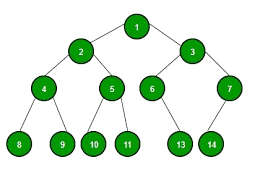

<h1> GO_ALGO</h1>

A powerful and interactive tool built with Java and JavaFX to help students and developers <strong>visualize how data structures work</strong> in real-time.
Whether you're learning or teaching, this application provides a user-friendly way to understand the mechanics behind various data structures.

  

<h2> Features</h2>
<ul>
  <li>🎯 Step-by-step animation of operations (insert, delete, search)</li>
  <li>🧠 Educational tooltips and operation descriptions</li>
  <li>🎨 Clean, modern JavaFX UI with interactive controls</li>
  <li>📊 Real-time updates to data structure after every operation</li>
  <li>🧑‍💻 Analysis of Pseudo Code along with visualization</li>
</ul>

<h2> ALGORITHMS</h2>

  

<h3>Algorithms Covered</h3>

   Binary Search  
   Bubble Sort  
   Selection Sort  
   Breadth First Search 

  

<h2> DATA STRUCTURES</h2>

  

<h3>Data Structures Covered</h3>

   Linked List 
   Stack 
   Queue 
   Segment Tree

  

<h2>🛠️ TECHNOLOGIES USED</h2>
<ul>
  <li><strong>Java 21+</strong></li>
  <li><strong>JavaFX</strong> for the UI</li>
  <li><strong>Scene Builder</strong> (for FXML layout design)</li>
</ul>

<h2>🚀 INSTALLATION</h2>

<h3>Prerequisites</h3>
<ul>
  <li>Java JDK 11 or above</li>
  <li>JavaFX SDK</li>
  <li>IDE like IntelliJ IDEA, Eclipse, or VS Code with JavaFX support</li>
</ul>

<h3>Steps</h3>
<pre><code># Clone the repository
git clone https://github.com/Sabit166/go_algo.git
</code></pre>
Run the project using your IDE

<h2>📌 USAGE</h2>
<ul>
  <li>Launch the application.</li>
  <li>Navigate to "Data Structures" or "Algorithms"</li>
  <li>Select a data structure from the sidebar.</li>
  <li>Perform operations using the control panel.</li>
  <li>Watch the real-time visualization and understand how it works!</li>
  <li>Teach your students Data Structures and Algorithms using smart drawing technology</li>
</ul>

<h2>🤝 CONTRIBUTING</h2>

Contributions are welcome!

<ol>
  <li>Fork the repository</li>
  <li>Create a new feature branch: <code>git checkout -b feature-name</code></li>
  <li>Commit your changes: <code>git commit -m 'Add new feature'</code></li>
  <li>Push to the branch: <code>git push origin feature-name</code></li>
  <li>Create a Pull Request</li>
</ol>

Feel free to open issues or suggest improvements as well!

<h2>🫂 AUTHORS</h2>

  <strong>UI/UX</strong>

  
  <a href="https://github.com/Tamim-Rizvee" target="_blank">@Tamim-Rizvee</a>

  <strong>Backend</strong>

  
  <a href="https://github.com/Sabit166" target="_blank">@Sabit166</a>

  
  <a href="https://github.com/alif-ul-haque" target="_blank">@alif-ul-haque</a>

